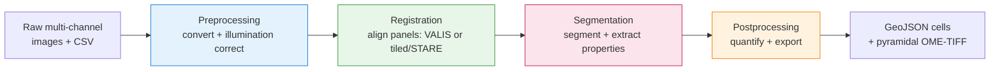

# Usage

Everything you need to run MIRAGE: the four-stage model, the samplesheet, the
command shapes, resuming from checkpoints, where outputs land, and the most common
fixes. For the full flag surface see [Parameters](parameters.md); to install see
[Installation](installation.md).

## The four-stage model

MIRAGE runs in **four stages, always in this order**. You choose where to enter
and exit with `--start` and `--stop` (both flags accept `preprocessing`, `registration`,
`segmentation`, or `postprocessing`). A stage runs only when it falls within the
`--start … --stop` window; omit `--stop` to run to the end, and use `--start X --stop X`
for exactly one stage.



- **Preprocessing** — Bio-Formats conversion (nuclear marker → channel 0), plus optional BaSiC
  illumination correction. The correction is **off by default** (`skip_preprocessing` is `true`;
  set it `false` in a params file or profile to run it); the conversion always runs.
- **Registration** — whole-slide alignment of every panel onto the reference panel, via
  `--registration_method`: **VALIS** (default, graph-based) or **tiled/STARE**
  (JVM-free, fully parallel — see [Parameters → Tiled / STARE](parameters.md#tiled-stare-registration_methodtiled)).
- **Segmentation** — cell/nucleus segmentation on the reference panel + morphology/contour extraction.
- **Postprocessing** — per-cell quantification + QuPath GeoJSON export + pyramidal OME-TIFF.

!!! info "No built-in cell typing"
    MIRAGE does not assign cell types — the exported GeoJSON carries **raw marker
    intensities** with a constant `"Cell"` classification, so you gate and phenotype
    downstream in QuPath or [FlowPath](https://flowpath.readthedocs.io/).

!!! tip "Adding a new imaging cycle later?"
    To fold a fresh cyclic-IF cycle into an already-completed run — reusing the prior
    reference, segmentation mask, and old-marker quantification — use
    `--mode add_cycle` instead of the linear stages. See [Incremental cycles](add_cycle.md).

## Quick start (synthetic data)

No real images, no GPU, no HPC — runs on any laptop in ~15 minutes:

```bash
git clone https://github.com/sceriff0/mirage.git && cd mirage
python tests/testdata/generate_complete_testdata.py
nextflow run . -profile test,docker --outdir results
```

## The minimal command

Run the whole pipeline on your own data:

```bash
nextflow run . --input samplesheet.csv --outdir results -profile docker -c site.config
```

`--input`, `--outdir`, `--max_cpus` and `--max_memory` are all **required**; the
last two come from `site.config` — see [Make a site config](installation.md#size-your-run).
`-profile` selects execution + container profiles, comma-combined.

!!! note "Two kinds of flags"
    Nextflow distinguishes **pipeline parameters** (double dash, `--input`) from
    **Nextflow options** (single dash, `-profile`, `-resume`, `-c`,
    `-params-file`). Both appear on the same command line.

### Runtime flags

| Flag | Kind | Required | Description |
|---|---|:---:|---|
| `--input` | param | yes | Samplesheet CSV. Columns depend on `--start` — see [the samplesheet](#the-samplesheet). |
| `--outdir` | param | yes | Output root directory. Checkpoints are written to `<outdir>/csv/`. |
| `--start` | param | no | Entry stage: `preprocessing` (default), `registration`, `segmentation`, `postprocessing`. |
| `--stop` | param | no | Last stage to run. Omitted = run to the end. |
| `dry_run` | param | no | Validate inputs and the samplesheet, then exit without running tasks. Boolean — set it in a `-params-file` (`params/dry_run.json`), never on the CLI; see [Boolean parameters](#boolean-parameters). |
| `--cleanup_level` | param | no | Which published outputs to keep: `none` (default — everything, re-enterable by `--start` or `add_cycle`) or `final` (final artifacts only; intermediates are never published). |
| `cleanup_work` | param | no | Delete `work/` after a successful run. **On by default**; incompatible with `-resume`. Boolean — set it in a `-params-file`, never on the CLI; see [Boolean parameters](#boolean-parameters). |
| `-profile` | option | no | Execution/config profiles, comma-combined (e.g. `slurm,singularity`). `tma` is a data-shape profile for tissue-microarray cores (VALIS non-rigid size 1024 px under `memory_mode custom`); add it to the site profiles, e.g. `slurm,singularity,tma`. See [Tiers](parameters.md#tiers). |
| `-params-file` | option | no | JSON preset of parameters, e.g. `params/full_pipeline.json`. |
| `-resume` | option | no | Reuse cached results from a previous run's `work/`. |
| `-c` | option | yes on a cluster | Layer your `site.config` (required `max_cpus`/`max_memory`, SLURM fields). See [Make a site config](installation.md#size-your-run). |

For the complete parameter list see [Parameters](parameters.md).

### Boolean parameters

**A boolean parameter cannot be passed on the command line.** Set it in a
`-params-file` or a profile instead:

```bash
# works
nextflow run . --input samplesheet.csv --outdir results -c site.config -params-file params/dry_run.json

nextflow run . --input samplesheet.csv --dry_run true   # x fails on Nextflow 26
nextflow run . --input samplesheet.csv --dry_run        # x fails on Nextflow 26
```

Nextflow 26 hands every `--param` to the schema validator as a **string**, so a
boolean arrives as `"true"` rather than `true` and validation rejects it:

```
* --dry_run (true): Value is [string] but should be [boolean]
```

Both CLI forms fail — `--flag true` and a bare valueless `--flag` alike. Probed
directly, a bare `--dry_run` resolves to `java.lang.Boolean` on 25.04.7 and
`java.lang.String` on 26.04.6. This applies to every boolean parameter in the
schema, not just `dry_run`, and it is why the examples in these docs write
booleans as `name = value` (params-file / config syntax) rather than as flags.

A `-params-file` carries a real JSON boolean, which takes a different code path
and works on both engines.

### Common invocations

=== "Full pipeline"

    ```bash
    nextflow run . --input samplesheet.csv --outdir results \
      --start preprocessing -profile docker \
      -params-file params/full_pipeline.json \
      -c site.config
    ```

=== "Single stage"

    ```bash
    nextflow run . --input samplesheet.csv --outdir results \
      --start preprocessing --stop preprocessing -profile docker \
      -c site.config
    ```

=== "Resume at registration"

    ```bash
    nextflow run . --input results/csv/preprocessed.csv --outdir results \
      --start registration -profile docker -resume \
      -c site.config
    ```

=== "Resume at segmentation"

    ```bash
    nextflow run . --input results/csv/registered.csv --outdir results \
      --start segmentation -profile docker -resume \
      -c site.config
    ```

=== "Resume at postprocessing"

    ```bash
    nextflow run . --input results/csv/segmented.csv --outdir results \
      --start postprocessing -profile docker -resume \
      -c site.config
    ```

=== "Dry run"

    ```bash
    nextflow run . --input samplesheet.csv --outdir results \
      --start preprocessing -params-file params/dry_run.json \
      -c site.config
    ```

## The samplesheet

MIRAGE is driven by a single CSV passed with `--input`. One row per image (one
acquisition panel); rows are grouped by `patient_id`, and each patient is processed
independently and in parallel.

!!! tip "Rules in brief"
    - One row per image; group rows by `patient_id`.
    - Exactly **one** `is_reference=true` row per patient (its coordinate space is
      the registration target).
    - `channels` is pipe-separated, in acquisition order, and **must include one of
      `params.nuclear_markers`** (default `DAPI`, `CELLTOX`; matched
      case-insensitively as a substring — a DAPI-free CELLTOX row is valid;
      `CONVERT_IMAGE` moves the matched channel to channel 0).
    - The image column depends on `--start`.

The required columns change with the entry point, because each stage consumes a
different kind of image:

| `--start` | Image column | Other required columns | Typical source |
|---|---|---|---|
| `preprocessing` | `path_to_file` | `patient_id`, `is_reference`, `channels` | your raw samplesheet |
| `registration` | `preprocessed_image` | `patient_id`, `is_reference`, `channels` | `<outdir>/csv/preprocessed.csv` |
| `segmentation` | `registered_image` | `patient_id`, `is_reference`, `channels` | `<outdir>/csv/registered.csv` |
| `postprocessing` | `registered_image` | `patient_id`, `is_reference`, `channels`, `cell_mask`, `nuclei_mask` | `<outdir>/csv/segmented.csv` |

### Supported formats {: #supported-formats }

Which formats this pipeline reads, and what each was verified against, is
recorded in [Format validation](validation/format_validation.md) — synthesised
fixtures for everything CI can generate (pyramidal OME-TIFF, BigTIFF, RGB,
8-bit, float32, HDF5, NDPI/NDPIS) on every push. The five vendor formats that
cannot be synthesised (`.czi`, `.nd2`, `.lif`, `.ndpi` real scanner bytes,
`.svs`) each need a cluster run against real vendor files, and as of this
release none has been recorded — the page marks all five "kit-validated:
pending" rather than omitting them.

Example raw samplesheet (`--start preprocessing`):

```csv
patient_id,path_to_file,is_reference,channels
P001,/data/raw/P001_panel1.nd2,true,DAPI|CD3|CD8|CD4
P001,/data/raw/P001_panel2.nd2,false,DAPI|PANCK|SMA|VIMENTIN
P002,/data/raw/P002_panel1.czi,true,DAPI|CD3|CD8|CD4
P002,/data/raw/P002_panel2.czi,false,DAPI|FOXP3|KI67|CD20
```

!!! success "You rarely write the later samplesheets by hand"
    Each stage emits the next stage's samplesheet as a checkpoint CSV — see below.

??? tip "Finding channel names from OME metadata"
    ```bash
    showinf -nopix -omexml-only /data/raw/P001_panel1.nd2 | grep -i "Channel"
    ```
    Or in Python: `AICSImage("file.nd2").channel_names`. Join the names with `|`.

## Checkpoints & resuming

Each stage writes one **aggregated checkpoint CSV** (covering all patients) to a
single `csv/` folder directly under `--outdir`. Each doubles as the next stage's
samplesheet — feed it back in with a matching `--start`.

```text
<outdir>/csv/preprocessed.csv     # after preprocessing  → feeds --start registration
<outdir>/csv/registered.csv       # after registration   → feeds --start segmentation
<outdir>/csv/segmented.csv        # after segmentation   → feeds --start postprocessing
<outdir>/csv/postprocessed.csv    # after postprocessing → manifest of final outputs
```

!!! danger "Checkpoints are in `<outdir>/csv/`, NOT `<outdir>/<patient>/csv/`"
    A frequent source of confusion: the resume CSVs are aggregated, one file each,
    directly under `--outdir` — not in the per-patient subtree. Keep `--outdir`
    consistent across stages so resume commands point `--input` at the right file.

!!! note "`-resume` vs `--start` — different mechanisms"
    - `-resume` reuses the **Nextflow work cache**; only changed tasks and their
      descendants re-run. Needs `work/` to still exist.
    - `--start` **skips earlier stages entirely** by feeding a checkpoint CSV. Needs
      only `--outdir`, so it is what you use when `work/` is gone — purged scratch, a
      different machine.

    **Prefer `-resume` when `work/` survives.** Changing a parameter and re-running
    with `-resume` re-runs only the tasks that parameter actually affects, with no
    checkpoint CSV and no `--start`: e.g. changing `--pyramid_resolutions` re-runs the
    pyramid and the exports and reuses the other 24 tasks.

    They compose (`--start postprocessing … -resume`), but understand what you get:
    `--start` reads its inputs from published paths under `--outdir`, which are
    different files from the `work/` originals as far as the cache is concerned, so
    the combination reuses **nothing** from a prior run's work directory. `-resume`
    there only helps across successive `--start postprocessing` runs.

!!! warning "`cleanup_work` is ON by default, and it removes the thing `-resume` needs"
    A successful run deletes its work directory, so a later `-resume` has no cache
    to reuse. It does **not** error — the run exits 0 and silently re-runs every
    task. On the stub dataset, `-resume` against an intact `work/` produced 57 cache
    hits; against a cleaned one, 0. Both green. The pipeline now **warns at launch**
    when `cleanup_work` and `-resume` are both in play; it does not refuse, because
    which one you meant is genuinely ambiguous.

    While you are iterating with `-resume`, put `{"cleanup_work": false}` in a
    `-params-file` — not in a `-c site.config`, which `nextflow.config`'s `cleanup`
    line cannot see; such a run is refused at launch rather than silently cleaned. `--start` restarts are unaffected either way: they read
    published paths under `--outdir`, never `work/` — but see `--cleanup_level`
    below, because at the `final` level those published paths are not written.
    Details: [Output cleanup](parameters.md#output-cleanup).

!!! warning "`--cleanup_level=final` does not publish intermediates"
    A `final` run keeps `pyramid/`, `geojson/`, `quantification/`, `spatialdata/`
    and the QC tree, and publishes nothing else — no `registered/`, no
    `segmentation/`, no checkpoint manifests under `csv/`.

    That means a `final` run's output **cannot be re-entered**: `--start
    registration` opens the paths `csv/registered.csv` names, and neither the
    manifest nor the images are there. Leave the default (`none`) on the run whose
    output you intend to restart from, or to use as a `--prior_outdir`.
    `--mode add_cycle` is refused at launch at any other level. (`final` was the
    default from 2026-08-25 to 2026-09-10.)
    Details: [Output cleanup](parameters.md#output-cleanup).

!!! warning "Two tasks always re-run"
    `GENERATE_QC_REPORT` and `AGGREGATE_SIZE_LOGS` are declared `cache = false`. Their
    inputs are `collectFile()` results, which are rebuilt into a fresh
    `work/tmp/<hash>/` on every run and so can never match the cache; the QC report
    also embeds a run timestamp. Both are cheap and terminal. Seeing exactly these two
    re-run on an otherwise fully-cached resume is correct — seeing anything *else*
    re-run is a determinism bug (`tests/resume_check.sh` checks precisely that).

## Execution profiles

Profiles are defined in `nextflow.config` and combine with commas — pick one
**execution** profile and one **container** profile.

| Profile | Kind | What it does |
|---|---|---|
| `docker` | container | Run processes in Docker (local/dev). |
| `singularity` | container | Run processes in Singularity/Apptainer (recommended on HPC). |
| `conda` | container | Conda-managed environments (no containers). |
| `local` | executor | Local executor with conservative caps (4 CPU / 16 GB). |
| `slurm` | executor | Submit each process as a SLURM job. |
| `test` / `test_full` | data + caps | Bundled synthetic datasets, small resource caps, CPU segmentation. |
| `instantseg_test` / `cellsam_test` | data + caps | Test profiles exercising those segmentation backends. |

!!! note "Your own site profile"
    There is no shipped site profile. Copy `conf/site.config.template` to
    `site.config` and layer it with `-c site.config` — see
    [Make a site config](installation.md#size-your-run). A named profile is
    possible too (`profiles { mysite { includeConfig 'conf/mysite.config' } }`),
    but note that a profile body is evaluated while `nextflow.config` is parsed,
    whereas a `-c` file is layered afterwards and wins on params.

```bash
# Laptop demo
nextflow run . -profile test,docker --outdir results
# HPC production
nextflow run . -profile slurm,singularity --input samplesheet.csv --outdir results -c site.config
```

JSON presets in `params/` (`full_pipeline.json`, `preprocessing_only.json`,
`registration_only.json`, `postprocessing_only.json`, `test.json`) set sensible
defaults; load one with `-params-file` and override values inline.

## Running on HPC

On a cluster, combine the SLURM executor with Singularity containers:

```bash
nextflow run . -profile slurm,singularity \
  --input samplesheet.csv --outdir results --start preprocessing \
  -c site.config
```

- **Cache images once** — point `NXF_SINGULARITY_CACHEDIR` (and
  `SINGULARITY_CACHEDIR`) at a shared, writable path so images are pulled once.
- **Scheduler settings** — set `--slurm_partition`, `--slurm_account`,
  `--slurm_qos` (or use a site profile / a `-c site.config`).
- **GPU jobs** — request a GPU with `--gpu_type` matching `sinfo -o "%G"`; the
  request is emitted as `--gres=gpu:<value>` and Singularity passes the device with
  `--nv`. Set `seg_gpu = false` to force CPU.
- **Resource caps** — `--max_memory` and `--max_cpus` have **no default** (required
  at launch); `--max_time` defaults to `240.h`. All three clamp every per-process
  request; memory/time scale with `task.attempt`, so retries automatically ask
  for more (up to the cap). See the [cluster parameters](parameters.md#cluster-resources).
- **`DEEPCELL_ACCESS_TOKEN` on Singularity** — `singularity.envWhitelist`
  forwards it to the container by *reference*, so it must be present in the
  environment on the compute node itself, and a SLURM site launching with
  `--export=NONE` will silently stop delivering it.

A minimal `site.config` layered with `-c`:

```groovy
params {
    slurm_partition = 'compute'
    slurm_account   = 'myproject'
    max_memory      = '500.GB'
    max_cpus        = 64
    max_time        = '120.h'
}
```

## Parameter validation

Every parameter's type, allowed values and range is declared once in
`nextflow_schema.json` and enforced at launch by the
[nf-schema](https://nextflow-io.github.io/nf-schema/) plugin, pinned to
`nf-schema@2.5.1` in `nextflow.config`. A bad value stops the run before any
process is submitted, and every violation is reported at once, by flag name:

```text
ERROR ~ Validation of pipeline parameters failed!

The following invalid input values have been detected:

* --reg_qc (7): Expected any of [[0, 1, 2]]
* --seg_method (notamethod): Expected any of [[stardist, instantseg, cellsam]]
```

Validation is strict about **types**, which matters most with `-params-file`.
JSON lets you write `"skip_preprocess_qc": "false"` — a *string*, not a boolean —
and because every non-empty string is truthy in Groovy, that used to silently
turn the switch **on** and skip the QC a file that said "false" was asking for.
It is now rejected:

```text
* --skip_preprocess_qc (false): Value is [string] but should be [boolean]
```

Write booleans unquoted in a params file: `"skip_preprocess_qc": false`. The
same applies to numbers — a quoted `"reg_qc": "2"` is a string too and is now
rejected rather than silently coerced.

Rules a JSON Schema cannot express — `--stop` must not precede `--start`,
`--expanded_quantification` requires `--quantify_compartments`, samplesheet
semantics, `add_cycle` prerequisites — are still checked in `lib/` and fire
right after schema validation.

### Offline / air-gapped execution

Nextflow downloads `nf-schema` from the plugin registry the first time the
pipeline runs. On a compute node with no outbound network that fails at launch:

```text
ERROR ~ Plugin with id nf-schema not found in any repository
```

Pre-provision the plugin. Either route below works — pick one.

**1. A shared plugins directory** (recommended for a cluster)

On a host that *does* have network access, and with the same Nextflow version
the cluster runs:

```bash
export NXF_PLUGINS_DIR=/shared/nextflow/plugins   # readable from the compute nodes
nextflow plugin install nf-schema@2.5.1
ls "$NXF_PLUGINS_DIR"      # -> nf-schema-2.5.1/
```

`rsync` that directory across if it is not already on shared storage, then
export the same variable wherever the pipeline is launched (`~/.bashrc`, the
SLURM job script, or a site profile). Nextflow resolves plugins from
`NXF_PLUGINS_DIR` and never contacts the registry when the pinned version is
already present.

**2. The default cache, primed from the login node**

With no `NXF_PLUGINS_DIR` set, plugins live in `$NXF_HOME/plugins` (default
`~/.nextflow/plugins`). If the login node has network access and `$HOME` is
shared with the compute nodes, priming it once is enough:

```bash
nextflow plugin install nf-schema@2.5.1     # on the login node
```

Then set `NXF_OFFLINE=true` on the cluster so Nextflow skips every remote check
(plugin registry, version check) instead of waiting for it to time out:

```bash
export NXF_OFFLINE=true
nextflow run . -profile slurm,singularity -c site.config --input samplesheet.csv --outdir results
```

The plugin version is pinned exactly, never as a range, so the copy you
provision is the copy that runs. Re-provisioning is only needed when the pin in
`nextflow.config` changes.

## Outputs

Two output locations: per-patient **results** under `--outdir`, and aggregated
**checkpoints** under `<outdir>/csv/` (above).

The per-patient leaf directories below are the closed vocabulary
`lib/Layout.groovy`'s `PUBLISHED_KINDS` declares — a process publishing anywhere else
under `<outdir>/<patient_id>/` fails `tests/test_layout.py`. Two per-patient leaves are
exceptions: `spatialdata/`, published at the patient root by `EXPORT_SPATIALDATA`'s own
`pattern:` (see `conf/modules.config`) rather than through a `Layout.patientDir` kind,
and `qc/`, which `tests/test_layout.py` skips outright (no checkpoint CSV names it) and
which is likewise absent from `PUBLISHED_KINDS`.

```text
results/                          # = --outdir
├── <patient_id>/
│   ├── converted/                # standardized OME-TIFF (nuclear marker → ch0)
│   ├── preprocessed/             # *_corrected.ome.tif (BaSiC; only when skip_preprocessing=false)
│   ├── registered/               # *_registered.ome.tiff (+ summary/ error CSVs)
│   ├── segmentation/             # *_nuclei_mask.tif, *_cell_mask.tif
│   ├── cell_properties/          # morphology.csv, contours.json (+ nuclei/ subdir)
│   ├── split_channels/           # *.tiff, one per marker (add_cycle: + prior/ subdir,
│   │                             #   the prior run's re-split pyramid channels)
│   ├── quantify/                 # <patient>_<marker>_quant.csv, per-marker, pre-merge
│   ├── quantification/           # merged_quant.csv
│   ├── geojson/export/           # cells.geojson, cells_wholecell.geojson, cells_data.csv
│   ├── pyramid/                  # pyramid.ome.tiff (multi-resolution)
│   ├── spatialdata/              # <patient_id>.zarr (written by default;
│   │                             #   disable with --skip_spatialdata_export)
│   └── qc/                       # preprocess / registration / postprocessing QC
├── csv/                          # checkpoint CSVs (all patients)
└── qc/                           # aggregated HTML QC report
```

The tables you'll analyze:

| File | What it is |
|---|---|
| `quantification/merged_quant.csv` | One row per cell; morphology joined in. Per marker: a bare column (whole-cell mean, kept for FlowPath's fast path) plus `<MARKER>: <Compartment>: <Statistic>` keys. **Median is always emitted**; `--expanded_quantification` adds Mean and Sum; `--quantify_compartments` adds the Nucleus and Cytoplasm compartments alongside Cell. |
| `geojson/export/cells.geojson` | One QuPath feature per cell: whole-cell polygon + measurement array (centroid µm, marker intensities, morphology). Carries `nucleusGeometry` in compartment mode. |
| `geojson/export/cells_wholecell.geojson` | The same detections without nucleus geometry — lighter and faster to import. Compartment mode only. |
| `geojson/export/cells_data.csv` | The cell table with per-marker **z-scores** added. |
| `segmentation/*_cell_mask.tif` | Whole-cell instance labels (uint32); each non-zero value is one cell. |

These open directly in QuPath, napari, and OMERO, and feed
[FlowPath](https://flowpath.readthedocs.io/) for interactive gating. The exact
key grammar is a cross-repository contract — see
[Inputs & outputs → The measurement-key contract](outputs.md#the-measurement-key-contract).

## Troubleshooting & FAQ

??? question "Which segmentation backend should I use?"
    Pick with `--seg_method`: **`instantseg`** (default; channel-invariant, runs
    on an unconfigured clone; tune batch/tile size for GPU memory), **`stardist`**
    (reads channel 0, hardcoded — needs a nuclear marker there and a configured
    `segmentation_model_dir`), **`cellsam`** (finds the nuclear channel by name;
    needs a weight download via `DEEPCELL_ACCESS_TOKEN`, or a local
    `--cellsam_model_path`).

??? failure "Launch fails on an invalid value"
    `--start`/`--stop` must be `preprocessing|registration|segmentation|postprocessing`;
    `--registration_method` must be `valis|tiled`; `--seg_method` must be
    `stardist|instantseg|cellsam`. Typos exit before any process is submitted.

??? failure "`--input` validation error / wrong columns"
    The most common mistake is feeding the **preprocessing** samplesheet to
    `--start registration`. Each stage needs its own column (`path_to_file` →
    `preprocessed_image` → `registered_image`; `registration` and `segmentation`
    both key on `registered_image`, and `--start postprocessing` additionally
    requires `cell_mask` and `nuclei_mask`, since `segmented.csv` carries the
    segmentation masks alongside the image path). Feed the checkpoint CSV that
    matches the stage you're resuming.

??? failure "Out-of-memory / exit code 137 or 140"
    Almost always the job exceeded its memory/time grant. Raise `--max_memory`,
    `--max_cpus`, `--max_time`; MIRAGE auto-retries on `104,134,135,137,139,140,143`
    with scaled resources. For registration specifically, drop to
    `--memory_mode low` and lower `--reg_max_image_dim`.

??? failure "The run seems to hang at startup"
    Usually Nextflow pulling large container images on first run. Every
    MIRAGE-owned image is named in `modules/local/*.nf`'s `container` directive,
    or — for the per-backend images — in `lib/SegBackends.groovy` /
    `lib/WarpBackends.groovy`; `conf/modules.config` owns those processes'
    resources, not their images. The one exception is `BASICPY`, the single
    vendored nf-core module: `conf/modules.config`'s `withName: 'BASICPY'` block
    overrides its image to a digest-pinned reference, so that one image comes
    from `conf/modules.config` on purpose (see
    [Installation → Where tags live, and what they pin](installation.md#pre-pulling-container-images-optional)).
    Pre-pull them once with the list in
    [Installation → Pre-pulling container images](installation.md#pre-pulling-container-images-optional).

??? failure "Singularity: `FATAL: ... permission denied`"
    The cache isn't writable. Point it at a path you own:
    ```bash
    export NXF_SINGULARITY_CACHEDIR=$HOME/.singularity_cache
    export SINGULARITY_CACHEDIR=$HOME/.singularity_cache
    ```

??? failure "`expanded_quantification requires quantify_compartments to also be true`"
    Expanded output depends on compartments. Both are booleans, so set them in a
    `-params-file`: either add `"quantify_compartments": true` alongside
    `"expanded_quantification": true`, or drop `expanded_quantification` for a
    flat per-cell table. Neither can be passed on the command line — see
    [Boolean parameters](#boolean-parameters).

??? question "Do I need a GPU?"
    No — run CPU-only with `seg_gpu = false`. A GPU mainly accelerates `SEGMENT`.

??? tip "Resetting a stuck task"
    If `-resume` keeps re-running the same failing task after you've fixed params,
    clear just that task's cache by hash (shown in the error): `rm -rf work/<hash>*`
    then resume. Avoid `rm -rf work/` wholesale.

Still stuck? Open an issue with your command line, the relevant `.nextflow.log`
excerpt, and the failing task's `.command.log` on the
[GitHub tracker](https://github.com/sceriff0/mirage/issues).
